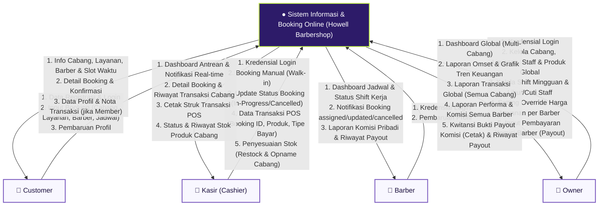
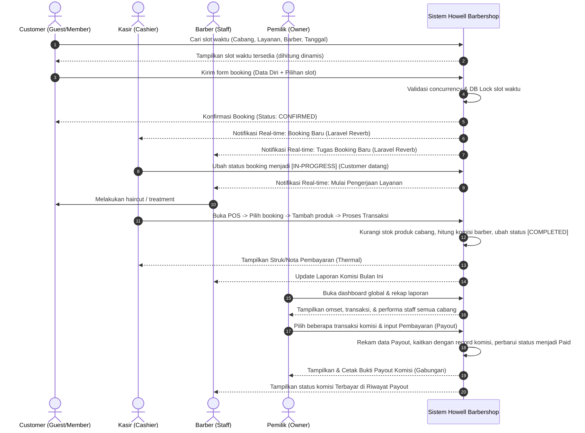

# Diagram Konteks & Alur Sistem (Context Diagram)

## Howell Barbershop — Sistem Informasi Manajemen & Booking Online

Dokumen ini mendefinisikan **Diagram Konteks (Context Diagram)** tingkat tinggi (DFD Level 0) dan aliran data sistem global untuk Howell Barbershop.

---

## 1. Diagram Konteks (Mermaid DFD Level 0)

Diagram Konteks menempatkan **Sistem Informasi & Booking Online (Howell Barbershop)** sebagai proses pusat, dengan aliran data yang terhubung langsung ke empat entitas eksternal: **Customer**, **Kasir (Cashier)**, **Barber**, dan **Owner**.

---

## 2. Aliran Data Rinci (Data Flow Details)

### 2.1 Customer (Pelanggan)

* **Aliran Masuk (Data Input ke Sistem)**:
  * **Data Registrasi & Login**: Nama, email, no HP, dan password untuk membuat/mengakses akun member.
  * **Data Reservasi Booking**: Pilihan cabang, jenis layanan/treatment, barber, serta slot tanggal & waktu.
  * **Update Profil**: Perubahan data diri pribadi.
* **Aliran Keluar (Data Output dari Sistem)**:
  * **Katalog & Slot Ketersediaan**: Informasi detail cabang, layanan, harga, barber, dan slot waktu yang tersedia secara real-time.
  * **Konfirmasi & Detail Booking**: Lembar e-receipt booking dengan status `CONFIRMED` yang berisi kode booking dan instruksi reservasi.
  * **Nota Pembayaran (Invoice)**: Riwayat transaksi retail/treatment jika melakukan transaksi sebagai member.

### 2.2 Kasir (Cashier)

* **Aliran Masuk (Data Input ke Sistem)**:
  * **Booking Manual (Walk-in)**: Input reservasi langsung untuk customer yang tidak menggunakan website booking online.
  * **Update Status Layanan**: Pembaruan status booking dari `CONFIRMED` menjadi `IN-PROGRESS` (layanan dimulai) atau `CANCELLED`.
  * **Data Transaksi POS**: Checkout tagihan booking dengan menambahkan produk retail (pomade, shampoo, dsb), kuantitas, dan metode pembayaran.
  * **Mutasi Stok Produk**: Form input bulk restock (stok masuk) dan bulk opname (penyesuaian stok fisik) di cabang bersangkutan.
* **Aliran Keluar (Data Output dari Sistem)**:
  * **Visualisasi Dashboard**: Daftar antrean harian cabang, status barber, dan notifikasi real-time via WebSocket.
  * **Cetak Struk Pembayaran**: Nota kasir format thermal roll untuk diserahkan ke pelanggan.
  * **Laporan Cabang**: Rekapitulasi transaksi harian dan status inventaris/stok retail cabang.

### 2.3 Barber

* **Aliran Masuk (Data Input ke Sistem)**:
  * **Kredensial Login**: Akses otentikasi dashboard internal barber.
* **Aliran Keluar (Data Output dari Sistem)**:
  * **Tugas Antrean Hari Ini**: Jadwal detail pengerjaan customer dan jenis layanan yang di-assign padanya.
  * **Notifikasi Real-time**: Peringatan saat ada booking baru, booking dipindah, atau dibatalkan oleh kasir.
  * **Laporan Komisi**: Transparansi perhitungan komisi jasa secara kumulatif berdasarkan persentase komisi yang ditetapkan owner.
  * **Riwayat Payout**: Informasi dan rincian transaksi pencairan komisi yang telah dibayarkan oleh Owner.

### 2.4 Owner (Pemilik)

* **Aliran Masuk (Data Input ke Sistem)**:
  * **Data Master Global**: Kelola data cabang, katalog layanan, data produk global, dan pendaftaran staff baru (kasir & barber).
  * **Roster & Penjadwalan**: Roster jam kerja mingguan staff dan tanggal libur cuti (leave schedule).
  * **Kebijakan Komisi & Harga**: Penetapan persentase komisi per barber dan pengaturan override harga layanan jika ada harga khusus per barber.
  * **Input Pembayaran Komisi (Payout)**: Memproses pembayaran komisi belum dibayar untuk barber tertentu (memilih satu atau beberapa transaksi komisi, memasukkan metode pembayaran, no. referensi, dan catatan).
* **Aliran Keluar (Data Output dari Sistem)**:
  * **Dashboard Keuangan Global**: Grafik tren omset, perbandingan pendapatan antar cabang, rekapitulasi penjualan produk, dan breakdown biaya komisi.
  * **Laporan Audit**: Riwayat transaksi detail dari semua cabang dan laporan kerja performa barber.
  * **Kwitansi & Riwayat Payout**: Kwitansi bukti pembayaran komisi yang mencakup seluruh item transaksi komisi yang dibayarkan dan riwayat pencairannya.

---

## 3. Aliran Sistem Global (Global Sequence Flow)

