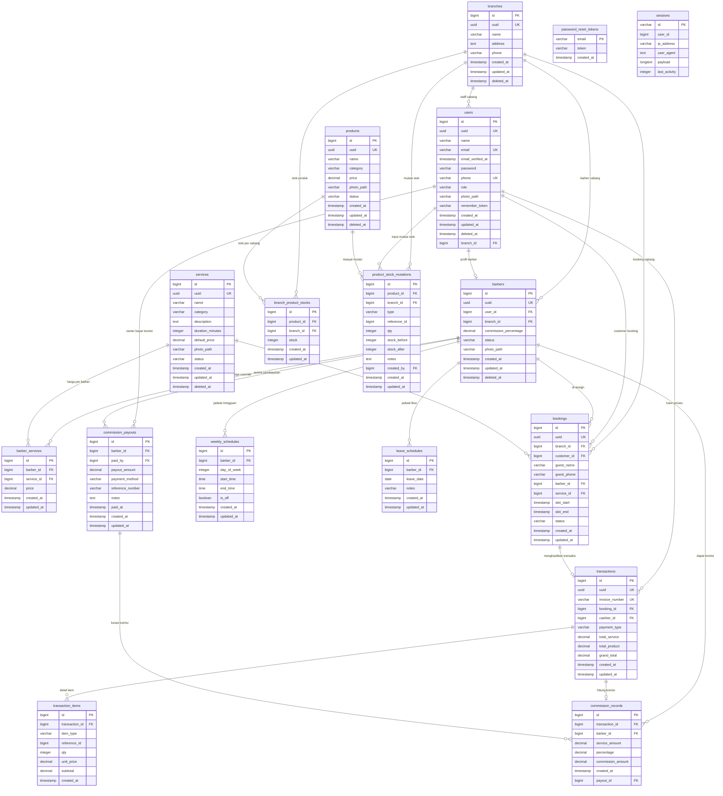

# Entity Relationship Diagram (ERD)
## Howell Barbershop — Sistem Informasi Manajemen & Booking Online

> **Catatan Schema:**
> - `products` tidak lagi memiliki `branch_id` dan `stock` (di-drop saat restrukturisasi stok).
> - Stok produk dikelola per-cabang melalui tabel pivot `branch_product_stocks`.
> - `product_stock_mutations` memiliki `branch_id` untuk melacak mutasi per cabang.
> - `commission_records` terhubung ke `commission_payouts` melalui `payout_id` (nullable) untuk mencatat histori pembayaran komisi barber.

---

