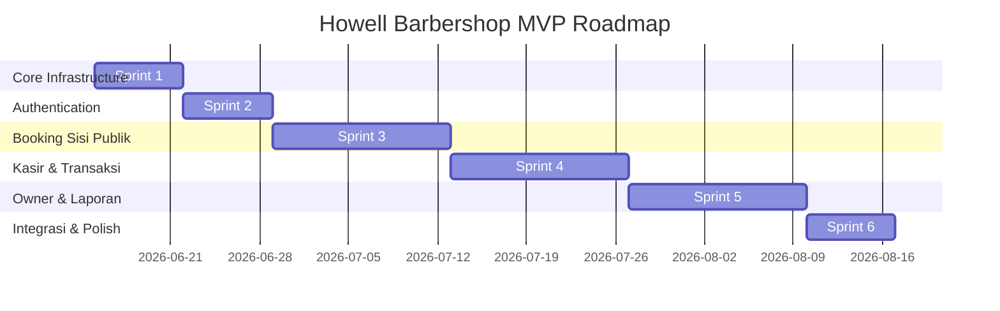

# Sprint Development Plan
# Howell Barbershop — Sistem Informasi Manajemen & Booking Online

Dokumen ini adalah rencana kerja pengembangan perangkat lunak (*Sprint Plan*) untuk aplikasi Howell Barbershop. Rencana ini dibagi menjadi **6 Sprint** dengan tugas-tugas detail berukuran kecil agar mudah dilacak (*trackable*) dan didelegasikan selama masa *development*.

---

## Ringkasan Sprint Roadmap

---

## Detail Breakdown Sprint

### Sprint 1: Project Initialization & Database Setup
**Fokus**: Membangun fondasi proyek, arsitektur folder, migrasi tabel database, model relasional, dan seeding data awal.
**Durasi**: 1 Minggu (Est. Mulai: 15 Juni 2026)

- [x] **SP-1.1: Inisialisasi Proyek Laravel & React**
  * Membuat proyek Laravel 12 baru menggunakan Inertia.js dan React.
  * Mengintegrasikan Tailwind CSS dan menyalin variabel CSS dari [HOWELL_DESIGN_SYSTEM.md](file:///E:/Study%20Area/JOKI/howell-barber/docs/HOWELL_DESIGN_SYSTEM.md).
  * Setup arsitektur folder frontend berbasis fitur (*feature-based*).
  * *Est: 1 Hari / SP: 2*
- [x] **SP-1.2: Konfigurasi Database PostgreSQL**
  * Konfigurasi berkas `.env` untuk koneksi PostgreSQL lokal/stage.
  * Menyiapkan ekstensi PostgreSQL (seperti `pgcrypto` atau fungsi `gen_random_uuid()` jika menggunakan versi DB lama).
  * *Est: 0.5 Hari / SP: 1*
- [x] **SP-1.3: Pembuatan File Migrasi Database**
  * Menulis migrasi untuk tabel master: `branches`, `users`, `barbers`, `services`, `products`.
  * Menulis migrasi untuk tabel transaksional: `barber_services` (override price), `bookings`, `transactions`, `transaction_items`, `commission_records`.
  * Menulis migrasi untuk jadwal: `weekly_schedules` (shift mingguan), `leave_schedules` (cuti).
  * *Est: 1.5 Hari / SP: 3*
- [x] **SP-1.4: Implementasi Indexing Database Strategis**
  * Menambahkan definisi indeks pada file migrasi sesuai [DATABASE_DESIGN.md](file:///E:/Study%20Area/JOKI/howell-barber/docs/DATABASE_DESIGN.md).
  * Membuat *Partial Index* `idx_bookings_active_slots` untuk efisiensi availability check.
  * Membuat composite index untuk pencarian per cabang (`branch_id` + `status`) dan laporan komisi (`barber_id` + `created_at DESC`).
  * *Est: 1 Hari / SP: 2*
- [x] **SP-1.5: Pembuatan Model Eloquent & Relasi**
  * Membuat file Model Laravel lengkap dengan deklarasi relasi `hasMany`, `belongsTo`, dll.
  * Mengimplementasikan Trait `HasUuids` bawaan Laravel pada kolom `uuid`.
  * Mengintegrasikan Trait `SoftDeletes` pada model `User`, `Barber`, `Service`, dan `Product`.
  * *Est: 1 Hari / SP: 2*
- [x] **SP-1.6: Pembuatan Seeders & Factories**
  * Menulis Laravel Factories untuk menghasilkan data palsu yang realistis.
  * Menulis Seeder untuk memasukkan cabang default, owner default, cashier default, 3 barber default dengan shift mingguan, daftar layanan, dan 10 produk testing.
  * *Est: 1 Hari / SP: 2*

---

### Sprint 2: Core Authentication & Profile Management
**Fokus**: Sistem login multi-role, registrasi customer baru, otorisasi akses menu (middleware), dan profil akun mandiri termasuk upload gambar.
**Durasi**: 1 Minggu (Est. Mulai: 22 Juni 2026)

- [x] **SP-2.1: Implementasi Halaman Login Multi-Role**
  * Membuat halaman login menggunakan tema warna Deep Violet dari Howell Design System.
  * Menghubungkan proses autentikasi session-based melalui Laravel Breeze / custom auth controller.
  * *Est: 1 Hari / SP: 2*
- [x] **SP-2.2: Otorisasi & Redireksi Role Middleware**
  * Membuat middleware Laravel (misal: `RoleMiddleware`) untuk menyaring akses URL (`/owner/*`, `/cashier/*`, `/barber/*`).
  * Mengatur alur redireksi pasca-login: Owner ke `/owner/dashboard`, Kasir ke `/cashier/dashboard`, Barber ke `/barber/dashboard`, Customer ke landing page.
  * *Est: 1 Hari / SP: 2*
- [x] **SP-2.3: Registrasi Customer (Member)**
  * Membuat form pendaftaran akun customer (Nama, Email, No HP, Password).
  * Menambahkan validasi server-side dan client-side (format email valid, nomor HP unik, minimal 8 karakter password).
  * *Est: 1 Hari / SP: 2*
- [x] **SP-2.4: Halaman Manajemen Profil Mandiri**
  * Membuat halaman profile untuk semua user login.
  * Mengimplementasikan form edit nama, email, nomor HP, dan ubah password dengan verifikasi password lama.
  * *Est: 1 Hari / SP: 2*
- [x] **SP-2.5: Modul Upload Foto Profil / Media**
  * Membuat backend service helper untuk menangani penyimpanan file gambar (lokal atau cloud storage).
  * Menambahkan validasi gambar (maksimal 2MB, format jpg/png).
  * Menghubungkan upload file ke kolom `photo_path` di tabel terkait.
  * *Est: 1 Hari / SP: 2*

---

### Sprint 3: Booking Engine (Public & Customer-Facing)
**Fokus**: Antarmuka landing page utama yang memukau dan alur formulir pemesanan booking online multi-cabang (untuk member maupun guest).
**Durasi**: 2 Minggu (Est. Mulai: 29 Juni 2026)

- [x] **SP-3.1: Desain Landing Page Publik**
  * Membangun landing page publik Howell Barbershop dengan tema gelap premium (Dark Canvas).
  * Menampilkan informasi daftar cabang, galeri potret, serta tombol CTA utama "Book Now" dengan gaya `{button-accent}` (Electric Lime).
  * *Est: 2 Hari / SP: 3*
- [x] **SP-3.2: Alur Booking Step 1 & 2: Pilih Cabang & Layanan**
  * Step 1: Pilihan Cabang (mengambil data dari database).
  * Step 2: Pilihan Layanan (mengambil layanan aktif dari cabang yang dipilih). Menampilkan durasi dan harga.
  * *Est: 2 Hari / SP: 2*
- [x] **SP-3.3: Alur Booking Step 3: Pilih Barber & Harga Khusus**
  * Step 3: Menampilkan daftar barber yang bekerja di cabang terpilih.
  * Mengkalkulasi harga layanan: menerapkan harga override dari tabel `barber_services` jika ada, atau fallback ke default price dari tabel `services`.
  * *Est: 2 Hari / SP: 3*
- [x] **SP-3.4: Alur Booking Step 4: Kalkulator Slot Waktu Dinamis**
  * Step 4: Menampilkan kalender 7 hari ke depan.
  * Membuat service logic di backend (`ScheduleService.php`) untuk menghitung slot jam yang tersedia.
  * Algoritma kalkulasi: `Jam Kerja Barber` - `Booking Existing (confirmed/in-progress)` - `Tanggal Libur (Leave Date)`. Hanya menampilkan slot yang pas dengan durasi layanan.
  * *Est: 3 Hari / SP: 5*
- [x] **SP-3.5: Alur Booking Step 5: Konfirmasi & Simpan Booking**
  * Step 5: Form data diri. Jika Guest: input nama & HP. Jika member terautentikasi: otomatis terisi.
  * Menyimpan data booking ke tabel `bookings` dengan status awal `confirmed`.
  * *Est: 1 Hari / SP: 2*
- [x] **SP-3.6: Halaman Sukses Booking (Invoice/Tiket)**
  * Membuat halaman sukses pasca booking dengan menampilkan detail pesanan (Cabang, Barber, Waktu, Estimasi Harga) dan kode QR atau UUID Booking.
  * *Est: 1 Hari / SP: 1*

---

### Sprint 4: Cashier Panel & POS (Point of Sale)
**Fokus**: Panel antrean kasir harian, walk-in booking manual, modul transaksi penjualan produk retail, cetak struk pembayaran, dan pemotongan stok otomatis.
**Durasi**: 2 Minggu (Est. Mulai: 13 Juli 2026)

- [x] **SP-4.1: Panel Antrean Booking Kasir (List View)**
  * Membuat antarmuka kasir untuk memantau semua booking di cabangnya hari ini.
  * Menyediakan fitur pencarian cepat berdasarkan nama/nomor HP customer (mengoptimalkan index `idx_users_phone_unique`).
  * Menyediakan filter status booking (Confirmed, In-Progress, Completed, Cancelled).
  * *Est: 2 Hari / SP: 3*
- [x] **SP-4.2: Update Status State Machine Booking**
  * Implementasi tombol aksi kasir: `Confirmed` -> `Mulai Service` -> `In-Progress`.
  * Aksi pembatalan: `Confirmed/In-Progress` -> `Batalkan` -> `Cancelled`.
  * *Est: 1 Hari / SP: 2*
- [x] **SP-4.3: Fitur Tambah Booking Manual (Walk-in)**
  * Membuat form booking manual di sisi kasir untuk mencatat pelanggan yang datang langsung tanpa booking online.
  * Menambahkan fitur cari customer member berdasarkan HP; jika tidak ada, dicatat sebagai Guest.
  * *Est: 1.5 Hari / SP: 2*
- [x] **SP-4.4: POS Keranjang Belanja & Pembayaran (Service)**
  * Membuka transaksi kasir dari booking berstatus `In-Progress` (layanan otomatis masuk ke keranjang belanja).
  * *Est: 2 Hari / SP: 3*
- [x] **SP-4.5: POS Tambah Penjualan Produk Retail**
  * Memungkinkan kasir menambah produk retail ke keranjang belanja transaksi.
  * Validasi stok produk (stok produk di database tidak boleh bernilai negatif pasca transaksi).
  * *Est: 2 Hari / SP: 3*
- [x] **SP-4.6: Konfirmasi Pembayaran POS & Pengurangan Stok (Atomic)**
  * Pilihan tipe bayar: Cash, Transfer, QRIS.
  * Logika simpan transaksi: menulis ke tabel `transactions` dan `transaction_items` secara aman (menggunakan Database Transaction/Atomic).
  * Mengubah status booking terkait menjadi `completed`.
  * Mengurangi stok produk di tabel `products` secara otomatis.
  * Membuat layout cetak struk (*Print Receipt*) ramah printer thermal.
  * *Est: 2.5 Hari / SP: 4*

---

### Sprint 5: Owner Management & Laporan Komisi
**Fokus**: Modul CRUD data master kelola staff (kasir & barber), kelola layanan, kelola produk cabang, kelola jadwal kerja mingguan, dan pencatatan serta visualisasi laporan komisi barber.
**Durasi**: 2 Minggu (Est. Mulai: 27 Juli 2026)

- [x] **SP-5.1: Manajemen Staff (CRUD)**
  * Membuat halaman kelola staff untuk Owner.
  * Fitur: Tambah staff baru (pilih role: cashier / barber), edit profil staff, pindah cabang, dan non-aktifkan akun (soft delete).
  * *Est: 1.5 Hari / SP: 2*
- [x] **SP-5.2: Manajemen Layanan & Override Harga Barber**
  * Form CRUD layanan barbershop (kategori, nama, durasi, default price, upload foto service).
  * Halaman khusus untuk menyetel harga override layanan per barber (menyimpan ke `barber_services`).
  * *Est: 2 Hari / SP: 3*
- [x] **SP-5.3: Manajemen Produk & Stok Cabang**
  * Form CRUD produk per cabang (kasir hanya bisa edit stok, owner bisa full CRUD).
  * Validasi upload gambar produk.
  * *Est: 1.5 Hari / SP: 2*
- [x] **SP-5.4: Pengaturan Jadwal Mingguan & Libur Barber**
  * Modul untuk mengatur shift mingguan default per hari (tabel `weekly_schedules`).
  * Kalender interaktif untuk menandai hari libur insidental barber (tabel `leave_schedules`).
  * *Est: 2 Hari / SP: 3*
- [x] **SP-5.5: Kalkulator Penghitung Komisi Barber Otomatis**
  * Membuat database trigger / service listener di backend (`CommissionService.php`) yang mendengarkan event sukses transaksi POS.
  * Formula: `Nilai Layanan Terjual * Persentase Komisi Barber`. Hasil disimpan ke tabel `commission_records`.
  * *Est: 1 Hari / SP: 2*
- [x] **SP-5.6: Laporan Komisi Barber (Owner & Self-View)**
  * Laporan Owner: Menampilkan ringkasan pendapatan layanan dan total komisi semua barber dengan filter cabang dan rentang tanggal (mengoptimalkan index `idx_commissions_barber_date`).
  * Laporan Barber: Dasbor khusus barber untuk melihat rincian riwayat komisi miliknya sendiri.
  * *Est: 2 Hari / SP: 3*

---

### Sprint 6: Dashboards, Real-time Alerts, & Polish
**Fokus**: Halaman dashboard utama per role (Owner, Cashier, Barber), notifikasi real-time WebSocket via Laravel Reverb, dan optimasi performa query database.
**Durasi**: 1 Minggu (Est. Mulai: 10 Agustus 2026)

- [x] **SP-6.1: Dashboard Owner (Visual Analytics)**
  * Membuat widget ringkasan: Total Omset, Total Booking Selesai, Produk Terjual, Total Komisi Barber.
  * Membuat chart performa omset 30 hari terakhir (menggunakan Chart.js / Recharts).
  * *Est: 2 Hari / SP: 3*
- [x] **SP-6.2: Dashboard Cashier & Dashboard Barber**
  * Dashboard Kasir: Widget antrean booking hari ini, total transaksi hari ini, dan notifikasi pesanan masuk.
  * Dashboard Barber: Menampilkan jam shift kerja hari ini, list urutan customer hari ini, dan summary komisi bulan berjalan.
  * *Est: 1.5 Hari / SP: 2*
- [x] **SP-6.3: Integrasi Laravel Reverb (WebSocket Server)**
  * Konfigurasi Laravel Reverb dan setup Echo di sisi frontend React.
  * Menyiapkan event broadcasting untuk event booking baru dari customer.
  * *Est: 1.5 Hari / SP: 3*
- [x] **SP-6.4: Notifikasi In-App Real-time (Bell Alert)**
  * Membuat komponen lonceng notifikasi di navigasi kasir & barber.
  * Menampilkan peringatan pop-up / alert instant saat ada booking masuk atau dibatalkan oleh kasir tanpa perlu memuat ulang halaman.
  * *Est: 1 Hari / SP: 2*
- [x] **SP-6.5: Performance Review & Query Optimization**
  * Melakukan audit eksekusi SQL query menggunakan Laravel Telescope / Debugbar untuk memastikan query memanfaatkan index PostgreSQL yang telah dibuat.
  * Memastikan tidak ada *N+1 query problem* pada pemanggilan data relasi transaksional.
  * *Est: 1 Hari / SP: 2*

---

## Metrik Pelacakan & Aturan Main

1. **Definisi Selesai (Definition of Done / DoD)**:
   * Kode telah melewati tahap pengujian lokal tanpa error konsol.
   * Komponen UI telah menerapkan desain yang responsif sesuai dengan [HOWELL_DESIGN_SYSTEM.md](file:///E:/Study%20Area/JOKI/howell-barber/docs/HOWELL_DESIGN_SYSTEM.md).
   * Migrasi dan query database telah memanfaatkan skema indexing yang tepat.
2. **Pengujian Query**:
   * Setiap query pencarian slot jadwal wajib diuji menggunakan perintah `EXPLAIN ANALYZE` di PostgreSQL untuk mengonfirmasi penggunaan indeks `idx_bookings_active_slots`.
3. **Penyimpanan Media**:
   * Upload gambar harus divalidasi ketat di level backend (maksimal 2MB, ekstensi gambar aman) untuk mencegah kerentanan keamanan server.
