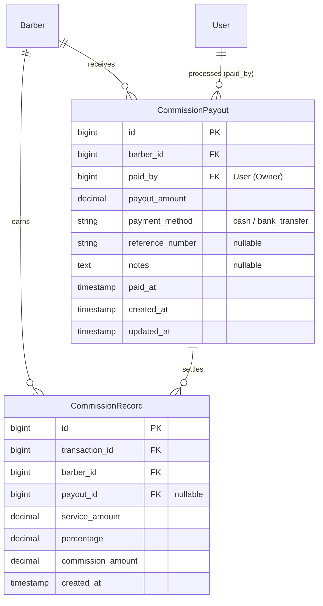

# Rencana Implementasi: Fitur Payout Komisi Barber
Dokumen ini merinci solusi analisis sistem dan langkah teknis untuk mencatat pembayaran komisi yang telah disalurkan kepada Barber (Payouts) di Howell Barbershop.

---

## 1. Arsitektur Hubungan Database (High-Level ERD)
Untuk mendukung pembayaran komisi secara kumulatif (batch payout), kita membuat tabel baru `commission_payouts` dan menghubungkannya dengan `commission_records` menggunakan foreign key `payout_id` yang bernilai nullable.



* **Aturan Bisnis Relasi:**
  * Jika `payout_id` pada `commission_records` bernilai `NULL`, artinya komisi tersebut **Belum Dibayar (Unpaid)**.
  * Jika `payout_id` terisi, artinya komisi tersebut **Sudah Dibayar (Paid)** dan terkait dengan transaksi payout tertentu.

---

## 2. Skema Database (Database Migrations)

### A. Tabel Baru: `commission_payouts`
```php
Schema::create('commission_payouts', function (Blueprint $table) {
    $table->id();
    $table->foreignId('barber_id')->constrained('barbers')->onDelete('restrict');
    $table->foreignId('paid_by')->constrained('users')->onDelete('restrict');
    $table->decimal('payout_amount', 12, 2);
    $table->string('payment_method'); // 'cash', 'bank_transfer'
    $table->string('reference_number')->nullable(); // no. resi/transaksi transfer
    $table->text('notes')->nullable();
    $table->timestamp('paid_at');
    $table->timestamps();
});
```

### B. Modifikasi Tabel: `commission_records`
Menambahkan kolom `payout_id` sebagai foreign key ke tabel `commission_payouts`.
```php
Schema::table('commission_records', function (Blueprint $table) {
    $table->foreignId('payout_id')->nullable()->constrained('commission_payouts')->onDelete('set null');
});
```

---

## 3. Struktur Kode & Layer Pattern

### A. Eloquent Models
* **`CommissionPayout.php`**:
  * Relasi `belongsTo(Barber::class)`
  * Relasi `belongsTo(User::class, 'paid_by')`
  * Relasi `hasMany(CommissionRecord::class, 'payout_id')`
* **`CommissionRecord.php`**:
  * Tambahkan relasi `belongsTo(CommissionPayout::class, 'payout_id')`
  * Tambahkan scope `scopeUnpaid($query)` dan `scopePaid($query)`

### B. Repository & Service Layer
* **`CommissionRepository`**:
  * Tambahkan method `getUnpaidCommissionsGroupedByBarber()` untuk dashboard Owner.
  * Tambahkan method `getUnpaidCommissionsForBarber(int $barberId)` untuk melihat detail komisi yang bisa dibayarkan.
* **`CommissionPayoutRepository`**:
  * Interface dan Class Repository baru untuk mencatat transaksi payout.
* **`CommissionService`**:
  * Tambahkan method `processPayout(int $barberId, array $commissionRecordIds, array $payoutData)`:
    1. Membuka DB Transaction (atomik).
    2. Validasi: pastikan semua `$commissionRecordIds` berstatus unpaid (`payout_id IS NULL`) dan memang milik `$barberId`.
    3. Hitung total komisi dari record yang dipilih.
    4. Buat record baru di `commission_payouts` dengan `payout_amount` = total komisi.
    5. Update `payout_id` pada seluruh `$commissionRecordIds` terpilih ke ID payout yang baru dibuat.
    6. Commit DB Transaction.

---

## 4. Alur UI (User Interface) pada Dashboard Owner
1. **Daftar Komisi & Status**: Owner membuka menu Laporan Komisi. Terdapat tab baru atau filter status: **Belum Dibayar (Unpaid)** vs **Sudah Dibayar (Paid)**.
2. **Tombol "Bayar Komisi"**: Pada baris nama Barber di tabel ringkasan komisi belum dibayar, Owner dapat mengklik tombol **"Bayar Komisi"**.
3. **Modal Pembayaran**:
   * Menampilkan daftar transaksi potong rambut yang komisinya belum dibayar untuk barber tersebut (berupa checkbox list).
   * Menghitung total pembayaran secara dinamis berdasarkan checkbox yang dicentang.
   * Input pilihan **Metode Pembayaran** (Cash / Transfer Bank).
   * Input opsional **Nomor Referensi** (misal no. resi transfer) & **Catatan**.
   * Klik tombol **"Konfirmasi Pembayaran"**.
4. **Struk/Kwitansi Payout**: Setelah pembayaran berhasil, sistem mencatat payout, menandai komisi terkait sebagai paid, dan menyajikan bukti kas keluar/payout untuk dicetak atau diarsipkan.
